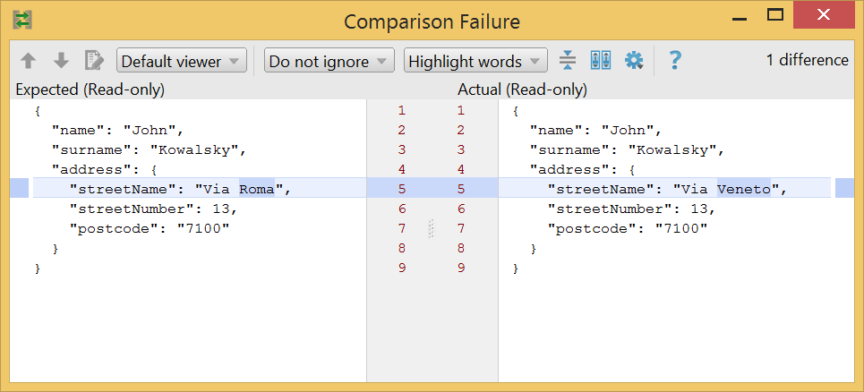

# Getting Started

Add approvalcrest to your project and write your first assertion in minutes.

## Choosing the Right Artifact

| Test framework | Artifact |
|---|---|
| JUnit 4 / JUnit 5 Vintage | `com.github.karsaig:approvalcrest:1.0.1` |
| JUnit 5 Jupiter (Java) | `com.github.karsaig:approvalcrest-junit-jupiter:1.0.1` |
| Kotlin + JUnit 5 | `com.github.karsaig:approvalcrest-junit-jupiter-kotlin:1.0.1` |

### JUnit 4 / Vintage (Maven)

```xml
<dependency>
    <groupId>com.github.karsaig</groupId>
    <artifactId>approvalcrest</artifactId>
    <version>1.0.1</version>
    <scope>test</scope>
</dependency>
```

### JUnit 5 Jupiter (Maven)

```xml
<dependency>
    <groupId>com.github.karsaig</groupId>
    <artifactId>approvalcrest-junit-jupiter</artifactId>
    <version>1.0.1</version>
    <scope>test</scope>
</dependency>
```

### Kotlin + JUnit 5 (Maven)

```xml
<dependency>
    <groupId>com.github.karsaig</groupId>
    <artifactId>approvalcrest-junit-jupiter-kotlin</artifactId>
    <version>1.0.1</version>
    <scope>test</scope>
</dependency>
```

## Your First `sameBeanAs` Assertion

`sameBeanAs` serialises both objects to JSON and diffs them, giving a clear error message when any field differs.

```java
import static com.github.karsaig.approvalcrest.jupiter.MatcherAssert.assertThat;
import static com.github.karsaig.approvalcrest.jupiter.matcher.Matchers.sameBeanAs;

@Test
void comparesTwoBeansFieldByField() {
    Address expected = new Address("Baker Street", "London");
    Address actual   = new Address("Baker Street", "London");

    assertThat(actual, sameBeanAs(expected));
}
```

No need to list every field — the whole object graph is compared automatically. See [same-bean-as](same-bean-as.md) for more.

## Your First `sameJsonAsApproved` Assertion

`sameJsonAsApproved` compares the actual output against a stored JSON file that you approve once and commit.

```java
import static com.github.karsaig.approvalcrest.jupiter.MatcherAssert.assertThat;
import static com.github.karsaig.approvalcrest.jupiter.matcher.Matchers.sameJsonAsApproved;

@Test
void myBeanMatchesApprovedSnapshot() {
    MyBean actual = buildMyBean();
    assertThat(actual, sameJsonAsApproved());
}
```

**Approval workflow:**

1. **First run** — no approved file exists yet. The library writes `<classHash>/<methodHash>-not-approved.json` next to your test source.
2. **Review** the generated file to make sure the output is correct.
3. **Rename** it from `*-not-approved.json` to `*-approved.json`.
4. **Subsequent runs** compare against the approved file and pass (or fail with a diff on mismatch).

See [same-json-as-approved](same-json-as-approved.md) for parameterized tests, file naming options, and more.

## Your First `sameContentAsApproved` Assertion

Works like `sameJsonAsApproved` but for arbitrary text — rendered templates, API response bodies, log output, generated reports, HTML fragments. Uses a `.content` file extension; no JSON parsing is performed.

```java
import static com.github.karsaig.approvalcrest.jupiter.MatcherAssert.assertThat;
import static com.github.karsaig.approvalcrest.jupiter.matcher.Matchers.sameContentAsApproved;

@Test
void renderedTemplateMatchesSnapshot() {
    String actual = renderWelcomeEmail("Alice");
    assertThat(actual, sameContentAsApproved());
}
```

The approval workflow is identical to `sameJsonAsApproved`: on first run a `*-not-approved.content` file is created, you review and rename it to `*-approved.content`, and subsequent runs compare against it.

See [same-content-as-approved](same-content-as-approved.md) for parameterized tests and further details.

## IDE Diff View

All matchers throw a `ComparisonFailure`-compatible exception, so IDEs (IntelliJ, Eclipse) display a side-by-side diff automatically.



**Important:** use `MatcherAssert.assertThat` from the approvalcrest package — **not** Hamcrest's `assertThat` — to get the `ComparisonFailure` that triggers the IDE diff view.
